# Guía de gráficos del tablero

Esta guía explica cada gráfico visual del tablero de TecnoHogar. Cada screenshot se genera desde las mismas funciones Plotly que usa Streamlit, por eso sirve como plan B para la defensa si la demo en vivo falla. Si aparece una sigla, buscarla en `glosario-abreviaturas.md`.

Valores base del caso: **93 controles**, **38.4% madurez**, **61.6% brecha**, **11 iniciativas**, **3 quick wins** y **604 jornadas**.

## Postura global

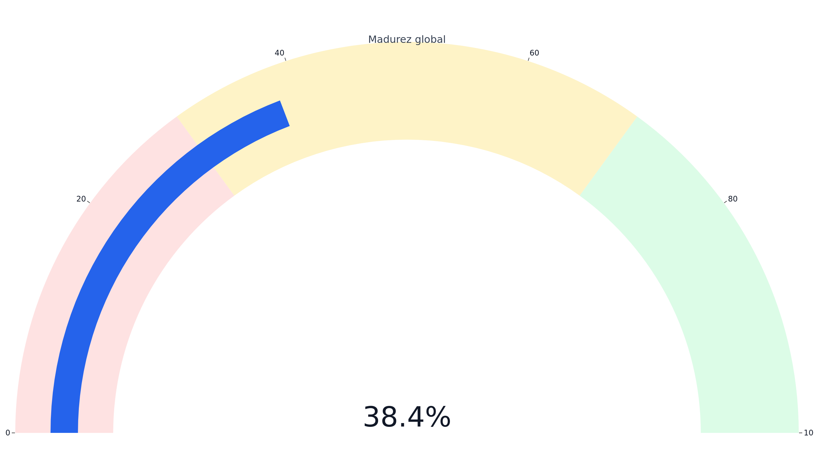

**Dónde aparece:** Tab 1 Ejecutivo, sección Postura general.

**Para qué sirve:** Resume la postura de seguridad en un indicador ejecutivo de madurez.

**Base teórica:** Tablero de control y KGI: sintetiza el estado frente a un objetivo de gobierno.

**Cómo se lee:** El valor central es la madurez porcentual. La escala visual ayuda a distinguir zona baja, media y alta.

**Qué dicen los datos de TecnoHogar:** La madurez global es 38.4% y la brecha global es 61.6%. La lectura defendible es que existe base operativa, pero falta formalizar, medir y sostener la mejora.

**Cómo explicarlo en la defensa:** Usarlo como apertura: es el número que resume el diagnóstico, pero no reemplaza el análisis por capítulo y control.

**Pregunta probable:** ¿Por qué usar un indicador global si seguridad es multidimensional?

**Respuesta sugerida:** Porque sirve para dirección; después se desagrega en capítulos, controles, brechas y proyectos para evitar una lectura simplista.

## Madurez por capítulo

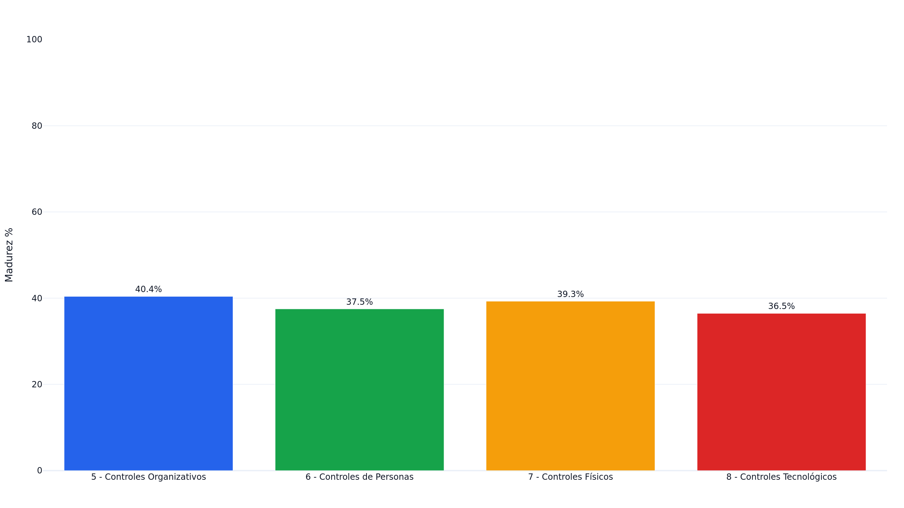

**Dónde aparece:** Tab 1 Ejecutivo, sección Madurez por capítulo.

**Para qué sirve:** Compara los cuatro capítulos evaluables de ISO/IEC 27002:2022.

**Base teórica:** ISO 27002 organiza controles en organizativos, personas, físicos y tecnológicos.

**Cómo se lee:** Cada barra muestra madurez promedio ponderada por capítulo. Más bajo implica mayor distancia al objetivo.

**Qué dicen los datos de TecnoHogar:** El capítulo más débil es 8 - Controles Tecnológicos con 36.5% de madurez. El más fuerte es 5 - Controles Organizativos con 40.4%, pero todos quedan lejos de un nivel optimizado.

**Cómo explicarlo en la defensa:** Explicar que el diagnóstico no queda en un promedio: muestra dónde concentrar la mirada inicial.

**Pregunta probable:** ¿El capítulo más bajo es automáticamente el único prioritario?

**Respuesta sugerida:** No. Marca una alerta, pero la priorización final usa brecha ponderada, capacidad afectada y proyectos vinculados.

## Distribución CMMI

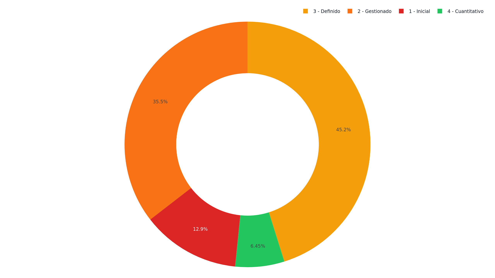

**Dónde aparece:** Tab 1 Ejecutivo, sección Distribución CMMI.

**Para qué sirve:** Muestra cuántos controles caen en cada nivel de madurez.

**Base teórica:** Escala CMMI 0 a 5: inexistente, inicial, gestionado, definido, cuantitativo y optimizado.

**Cómo se lee:** El gráfico reparte controles por nivel. Una concentración en niveles bajos implica prácticas poco repetibles o poco medidas.

**Qué dicen los datos de TecnoHogar:** 45 de 93 controles están en niveles 0 a 2. Esto muestra prácticas existentes pero todavía poco estandarizadas o medidas.

**Cómo explicarlo en la defensa:** Usarlo para defender que el promedio no oculta la forma de la distribución.

**Pregunta probable:** ¿Por qué varios controles tienen la misma brecha?

**Respuesta sugerida:** Porque comparten nivel CMMI; por eso el ranking usa brecha ponderada y no solo porcentaje de brecha.

## Radar ejecutivo

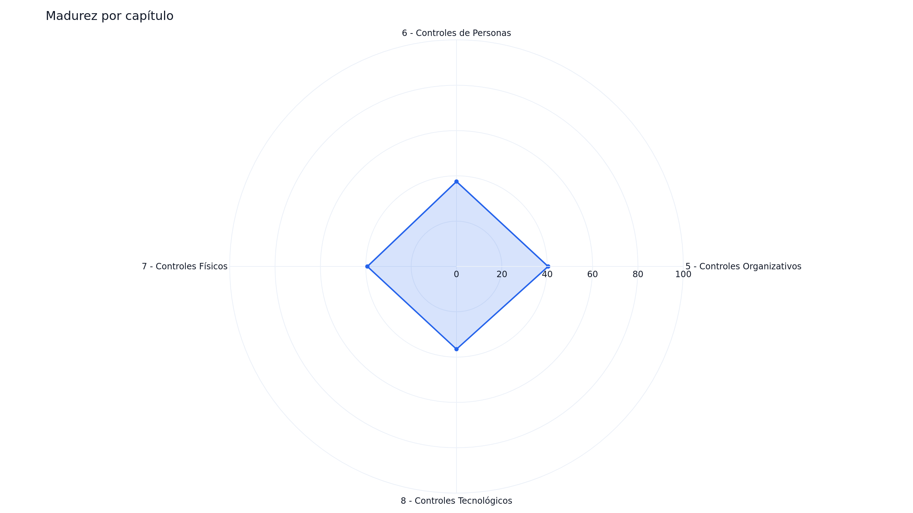

**Dónde aparece:** Tab 1 Ejecutivo, sección Radar ejecutivo.

**Para qué sirve:** Permite ver balance o desbalance entre capítulos ISO.

**Base teórica:** Radar de KPI: útil para comparar dimensiones equivalentes en una misma escala.

**Cómo se lee:** Cuanto más cercano al borde, mayor madurez. Un polígono irregular muestra desequilibrio de postura.

**Qué dicen los datos de TecnoHogar:** El capítulo más débil es 8 - Controles Tecnológicos con 36.5% de madurez. El más fuerte es 5 - Controles Organizativos con 40.4%, pero todos quedan lejos de un nivel optimizado.

**Cómo explicarlo en la defensa:** Explicar visualmente que TecnoHogar tiene brecha generalizada y no un único punto aislado.

**Pregunta probable:** ¿El radar reemplaza a la barra por capítulo?

**Respuesta sugerida:** No. La barra compara con precisión; el radar ayuda a contar balance de postura.

## Capacidades operacionales

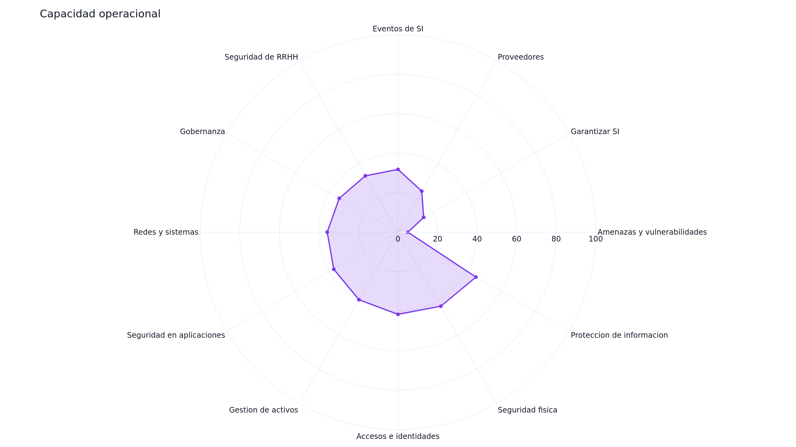

**Dónde aparece:** Tab 1 Ejecutivo, sección Capacidades operacionales.

**Para qué sirve:** Traduce controles ISO a capacidades de gestión entendibles para operar seguridad.

**Base teórica:** Métrica por capacidad: conecta controles con procesos de gestión y operación.

**Cómo se lee:** Cada eje es una capacidad. La distancia al borde indica madurez relativa.

**Qué dicen los datos de TecnoHogar:** La capacidad operacional más débil es Amenazas y vulnerabilidades con 5.0% de madurez.

**Cómo explicarlo en la defensa:** Usarlo para pasar del estándar a lenguaje de gestión: qué capacidad falta desarrollar.

**Pregunta probable:** ¿Las capacidades son parte literal de ISO?

**Respuesta sugerida:** No son capítulos ISO; son una agrupación operativa definida para interpretar mejor los controles.

## Matriz CMMI por capítulo

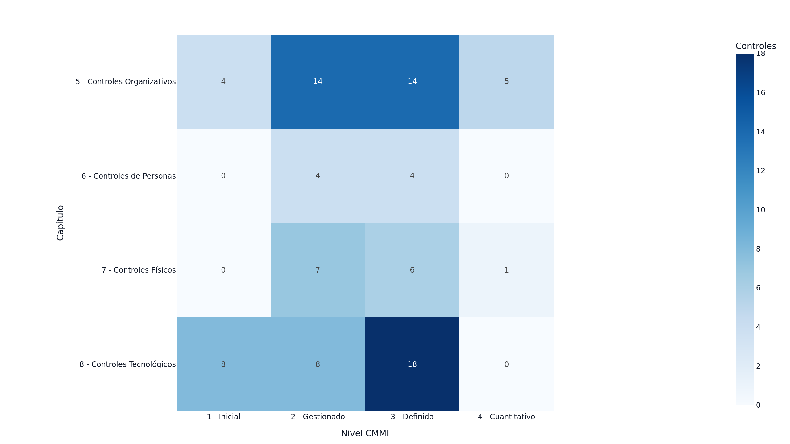

**Dónde aparece:** Tab 2 Mapa ISO, sección Mapa de madurez ISO.

**Para qué sirve:** Muestra la cantidad de controles de cada capítulo en cada nivel CMMI.

**Base teórica:** Mapa de calor: cruza dimensiones para encontrar concentración de debilidades.

**Cómo se lee:** Filas son capítulos, columnas son niveles CMMI y el color/celda indica cantidad de controles.

**Qué dicen los datos de TecnoHogar:** 45 de 93 controles están en niveles 0 a 2. Esto muestra prácticas existentes pero todavía poco estandarizadas o medidas.

**Cómo explicarlo en la defensa:** Explicar que este es el mapa completo de madurez, no solo el promedio.

**Pregunta probable:** ¿Por qué sirve cruzar capítulo y CMMI?

**Respuesta sugerida:** Porque permite ver si un capítulo tiene muchos controles bajos o pocos controles críticos.

## CMMI por capítulo

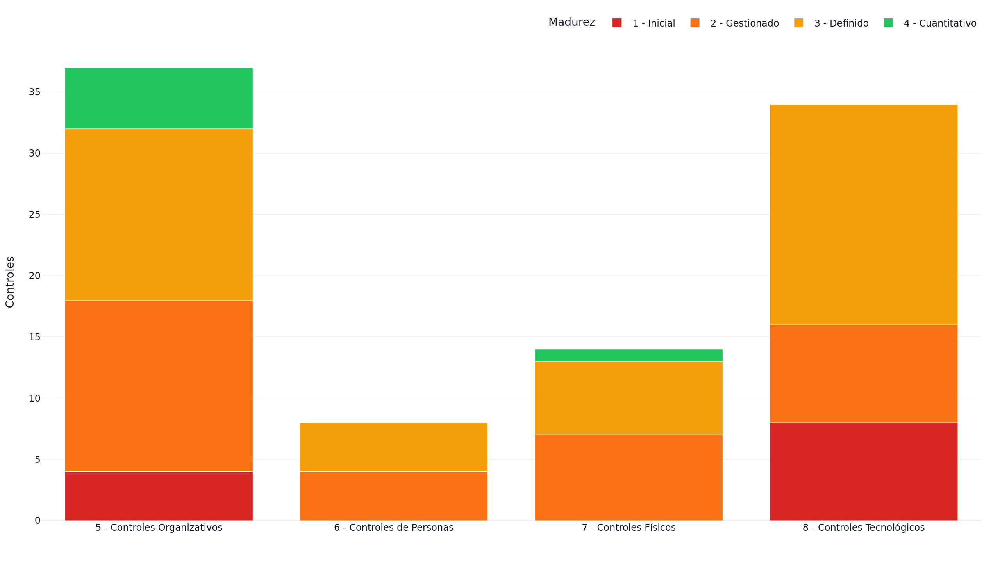

**Dónde aparece:** Tab 2 Mapa ISO, sección CMMI por capítulo.

**Para qué sirve:** Compara la composición de niveles CMMI dentro de cada capítulo.

**Base teórica:** Distribución por madurez: muestra dónde hay prácticas iniciales, definidas o medidas.

**Cómo se lee:** Cada barra apilada acumula controles del capítulo y los colores indican nivel CMMI.

**Qué dicen los datos de TecnoHogar:** 45 de 93 controles están en niveles 0 a 2. Esto muestra prácticas existentes pero todavía poco estandarizadas o medidas.

**Cómo explicarlo en la defensa:** Usarlo para mostrar que la brecha sale de controles concretos, no de percepción general.

**Pregunta probable:** ¿Se evaluaron todos los controles con la misma escala?

**Respuesta sugerida:** Sí. Todos los controles aplicables usan CMMI 0 a 5 y luego se ponderan por peso.

## Superficie de controles

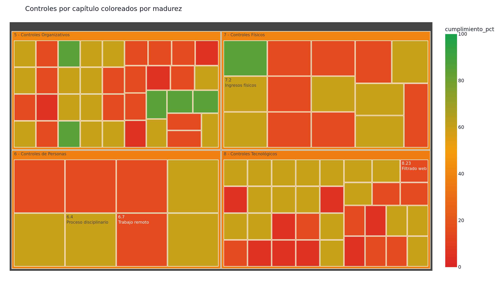

**Dónde aparece:** Tab 2 Mapa ISO, sección Superficie de controles.

**Para qué sirve:** Permite inspeccionar los 93 controles por capítulo y madurez.

**Base teórica:** Treemap: representa jerarquía y volumen; en este caso capítulo y control.

**Cómo se lee:** El tamaño responde al peso del control y el color al porcentaje de cumplimiento.

**Qué dicen los datos de TecnoHogar:** El capítulo más débil es 8 - Controles Tecnológicos con 36.5% de madurez. El más fuerte es 5 - Controles Organizativos con 40.4%, pero todos quedan lejos de un nivel optimizado.

**Cómo explicarlo en la defensa:** Usarlo en demo para mostrar navegación granular: de capítulo a control individual.

**Pregunta probable:** ¿Están las 93 métricas en estos cuadrados?

**Respuesta sugerida:** Sí, cada cuadrado representa un control evaluado; los filtros pueden cambiar qué subconjunto se ve.

## Funciones de ciberseguridad

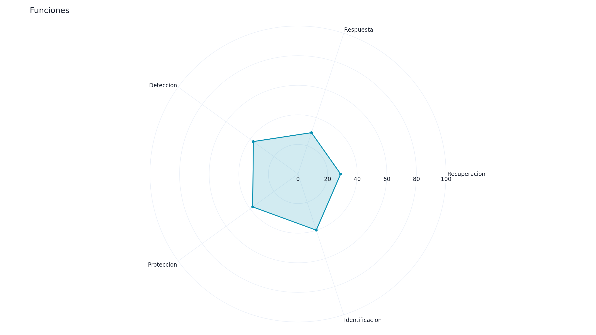

**Dónde aparece:** Tab 3 Perfil, sección Funciones de ciberseguridad.

**Para qué sirve:** Agrupa controles según funciones de identificar, proteger, detectar, responder y recuperar.

**Base teórica:** Modelo funcional de seguridad: ayuda a leer postura por ciclo operativo.

**Cómo se lee:** Cada eje representa una función; los valores más bajos muestran funciones con menor madurez.

**Qué dicen los datos de TecnoHogar:** La función más débil es Recuperacion con 28.8%, lo que orienta la conversación hacia resiliencia y seguimiento.

**Cómo explicarlo en la defensa:** Conectar con resiliencia: no alcanza proteger, también hay que detectar, responder y recuperar.

**Pregunta probable:** ¿Por qué usar funciones si ya tenemos capítulos ISO?

**Respuesta sugerida:** Porque los capítulos explican el estándar y las funciones explican la operación diaria.

## Capacidad operacional

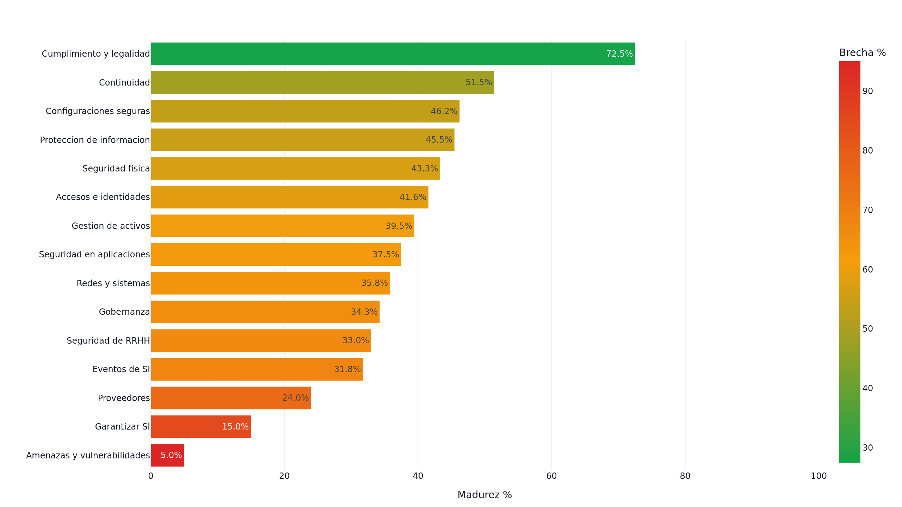

**Dónde aparece:** Tab 3 Perfil, sección Capacidad operacional.

**Para qué sirve:** Ordena capacidades de menor a mayor madurez para priorizar gestión.

**Base teórica:** KPI de gestión: transforma mediciones de controles en capacidades accionables.

**Cómo se lee:** Las barras horizontales muestran madurez; el color resalta la brecha asociada.

**Qué dicen los datos de TecnoHogar:** La capacidad operacional más débil es Amenazas y vulnerabilidades con 5.0% de madurez.

**Cómo explicarlo en la defensa:** Usarlo para justificar proyectos orientados a vulnerabilidades, monitoreo, accesos o gobierno.

**Pregunta probable:** ¿Qué diferencia hay entre capacidad y proyecto?

**Respuesta sugerida:** La capacidad describe qué tan madura está una práctica; el proyecto es la acción para mejorarla.

## Perfil CID

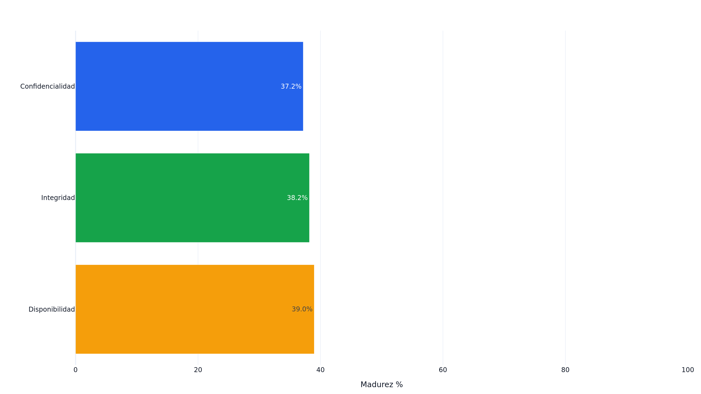

**Dónde aparece:** Tab 3 Perfil, sección CID.

**Para qué sirve:** Mide cómo se comportan los controles asociados a confidencialidad, integridad y disponibilidad.

**Base teórica:** CID es el eje clásico para analizar impacto de seguridad de la información.

**Cómo se lee:** Cada barra muestra madurez promedio de controles vinculados a una propiedad CID.

**Qué dicen los datos de TecnoHogar:** El atributo más débil es Confidencialidad (37.2%) y el más fuerte es Disponibilidad (39.0%).

**Cómo explicarlo en la defensa:** Relacionar con TP1: activos y criticidad se explican por confidencialidad, integridad y disponibilidad.

**Pregunta probable:** ¿CID se mide sobre activos o controles?

**Respuesta sugerida:** En TP1 se usó para activos; en este tablero se usa para leer controles asociados a esas propiedades.

## Tipo de control

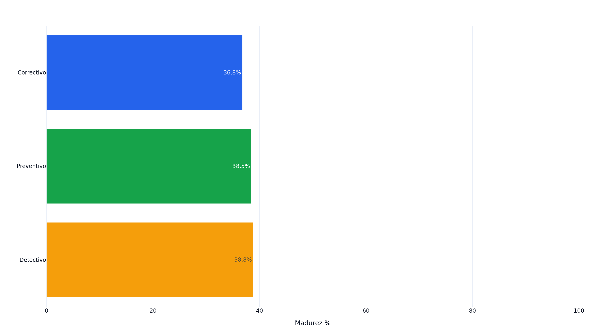

**Dónde aparece:** Tab 3 Perfil, sección Tipo de control.

**Para qué sirve:** Compara madurez de controles preventivos, detectivos y correctivos.

**Base teórica:** Defensa en profundidad: prevenir, detectar y corregir son capas complementarias.

**Cómo se lee:** Las barras muestran qué tipo de control tiene menor madurez relativa.

**Qué dicen los datos de TecnoHogar:** El atributo más débil es Correctivo (36.8%) y el más fuerte es Detectivo (38.8%).

**Cómo explicarlo en la defensa:** Explicar que seguridad madura no es solo prevenir: también requiere detección y respuesta.

**Pregunta probable:** ¿Qué pasa si un tipo queda más alto?

**Respuesta sugerida:** No significa que alcance; indica mejor desarrollo relativo frente a los otros tipos.

## Dominios de seguridad

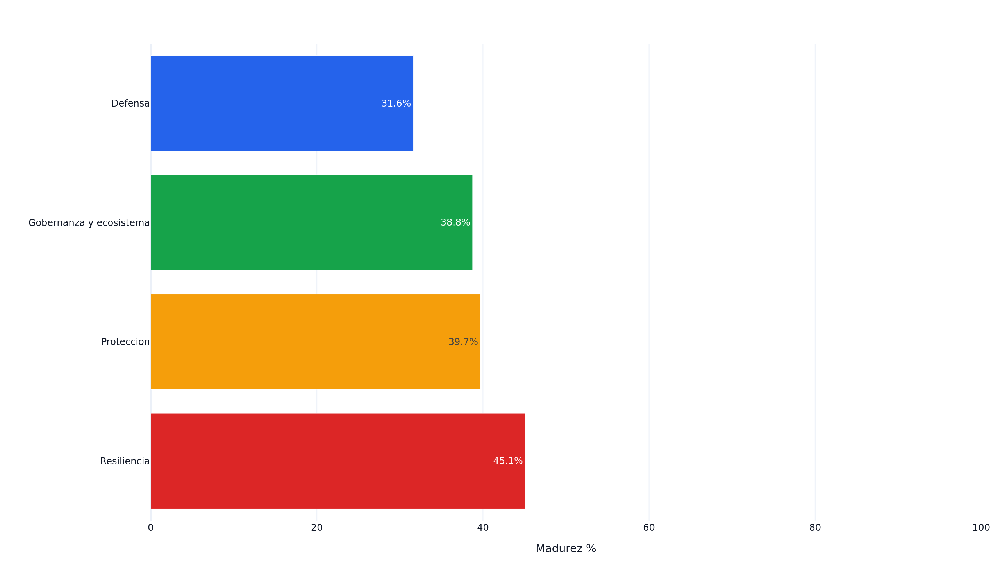

**Dónde aparece:** Tab 3 Perfil, sección Dominios.

**Para qué sirve:** Agrupa controles en dominios ejecutivos: gobierno, protección, defensa y resiliencia.

**Base teórica:** Lectura de tablero: reduce complejidad para conversar con dirección.

**Cómo se lee:** Cada barra muestra madurez promedio por dominio.

**Qué dicen los datos de TecnoHogar:** El atributo más débil es Defensa (31.6%) y el más fuerte es Resiliencia (45.1%).

**Cómo explicarlo en la defensa:** Usarlo para traducir el diagnóstico técnico a una conversación de gobierno.

**Pregunta probable:** ¿Estos dominios reemplazan ISO?

**Respuesta sugerida:** No. Son una vista de análisis construida encima del catálogo ISO.

## Pareto de brechas

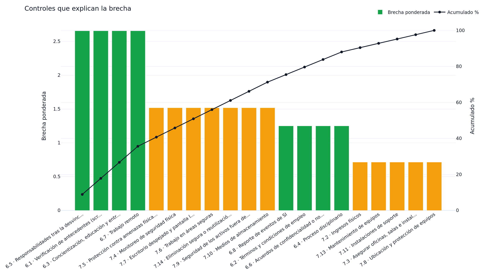

**Dónde aparece:** Tab 4 Brechas, sección Pareto de brechas.

**Para qué sirve:** Ordena los controles que más explican la brecha ponderada.

**Base teórica:** Principio de Pareto: encontrar pocos factores que concentran impacto.

**Cómo se lee:** Las barras muestran brecha ponderada y la línea muestra acumulado porcentual.

**Qué dicen los datos de TecnoHogar:** El control con mayor brecha ponderada es 6.1 - Verificación de antecedentes (screening) con peso de brecha 2.66.

**Cómo explicarlo en la defensa:** Usarlo como puente hacia el plan: primero atender lo que más pesa en la brecha.

**Pregunta probable:** ¿Por qué no priorizar todos los controles en orden ISO?

**Respuesta sugerida:** Porque el orden del estándar no indica impacto; el Pareto prioriza por brecha y peso.

## Treemap de brecha

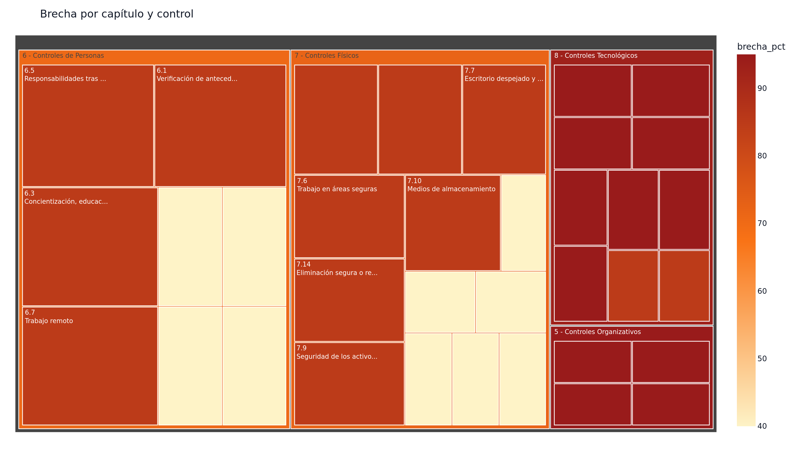

**Dónde aparece:** Tab 4 Brechas, sección Concentración de riesgo.

**Para qué sirve:** Muestra dónde se concentra la brecha por capítulo y control.

**Base teórica:** Visual de riesgo: tamaño y color ayudan a detectar concentración.

**Cómo se lee:** El tamaño representa peso de brecha y el color la brecha porcentual.

**Qué dicen los datos de TecnoHogar:** El control con mayor brecha ponderada es 6.1 - Verificación de antecedentes (screening) con peso de brecha 2.66.

**Cómo explicarlo en la defensa:** Explicar visualmente que las brechas combinan capítulo, control y severidad.

**Pregunta probable:** ¿El cuadrado más grande siempre es el más urgente?

**Respuesta sugerida:** Es candidato fuerte, pero la urgencia final también depende del proyecto, esfuerzo y contexto operativo.

## Madurez vs brecha

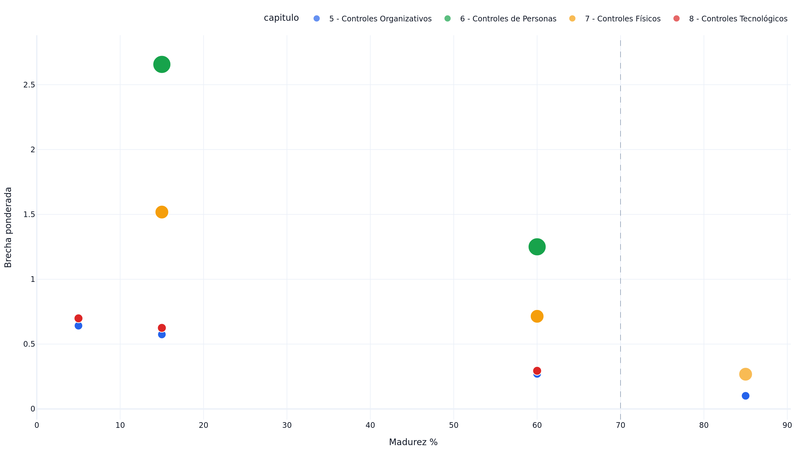

**Dónde aparece:** Tab 4 Brechas, sección Madurez vs brecha.

**Para qué sirve:** Cruza cumplimiento actual con brecha ponderada para distinguir controles bajos y pesados.

**Base teórica:** Priorización por riesgo: combina probabilidad/impacto aproximado mediante madurez y peso.

**Cómo se lee:** Eje X es madurez, eje Y brecha ponderada, tamaño es peso y color es capítulo.

**Qué dicen los datos de TecnoHogar:** El control con mayor brecha ponderada es 6.1 - Verificación de antecedentes (screening) con peso de brecha 2.66.

**Cómo explicarlo en la defensa:** Usarlo para explicar por qué un control puede ser más importante que otro con el mismo nivel CMMI.

**Pregunta probable:** ¿Qué significa la línea vertical en 70%?

**Respuesta sugerida:** Es una referencia visual de madurez aceptable; no es una regla absoluta del estándar.

## Plan por plazo

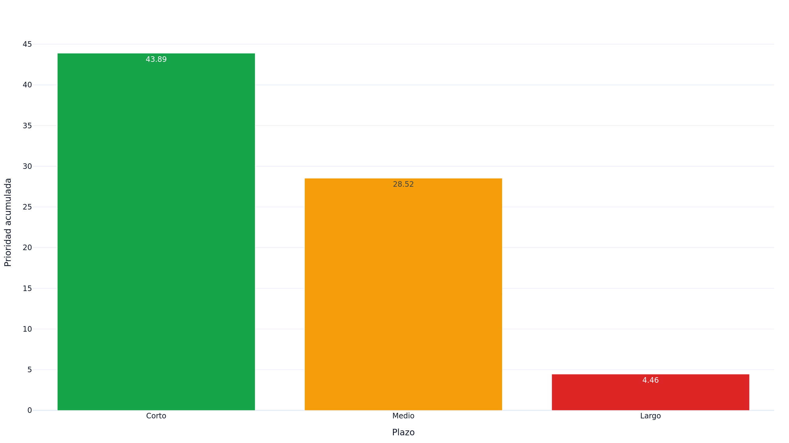

**Dónde aparece:** Tab 5 Plan, sección Plan por plazo.

**Para qué sirve:** Distribuye la prioridad del plan entre corto, medio y largo plazo.

**Base teórica:** Planificación de tratamiento de riesgo: secuencia acciones según impacto y capacidad de ejecución.

**Cómo se lee:** Cada barra acumula prioridad de proyectos por plazo.

**Qué dicen los datos de TecnoHogar:** El plazo con mayor prioridad acumulada es Corto, con 6 proyectos y prioridad 43.89.

**Cómo explicarlo en la defensa:** Mostrar que el plan tiene una secuencia, no una lista plana de deseos.

**Pregunta probable:** ¿Por qué no ejecutar todo a corto plazo?

**Respuesta sugerida:** Porque hay restricciones de esfuerzo, dependencia y madurez organizacional.

## Compromiso por plazo

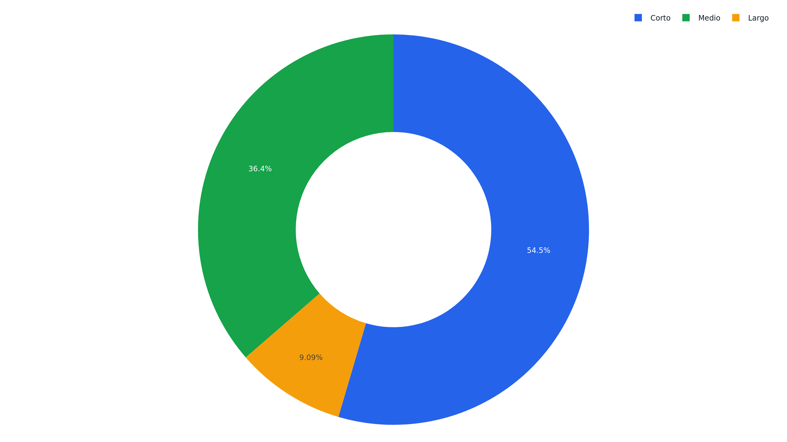

**Dónde aparece:** Tab 5 Plan, sección Compromiso por plazo.

**Para qué sirve:** Muestra cuántos proyectos caen en cada horizonte temporal.

**Base teórica:** Gestión de cartera: balancea cantidad de iniciativas y capacidad de absorción.

**Cómo se lee:** Cada porción representa cantidad de proyectos por plazo.

**Qué dicen los datos de TecnoHogar:** El plazo con mayor prioridad acumulada es Corto, con 6 proyectos y prioridad 43.89.

**Cómo explicarlo en la defensa:** Usarlo para explicar carga de gestión y no solo prioridad técnica.

**Pregunta probable:** ¿Cantidad de proyectos equivale a esfuerzo?

**Respuesta sugerida:** No. Por eso se complementa con roadmap y esfuerzo por proyecto.

## Tipo de proyecto

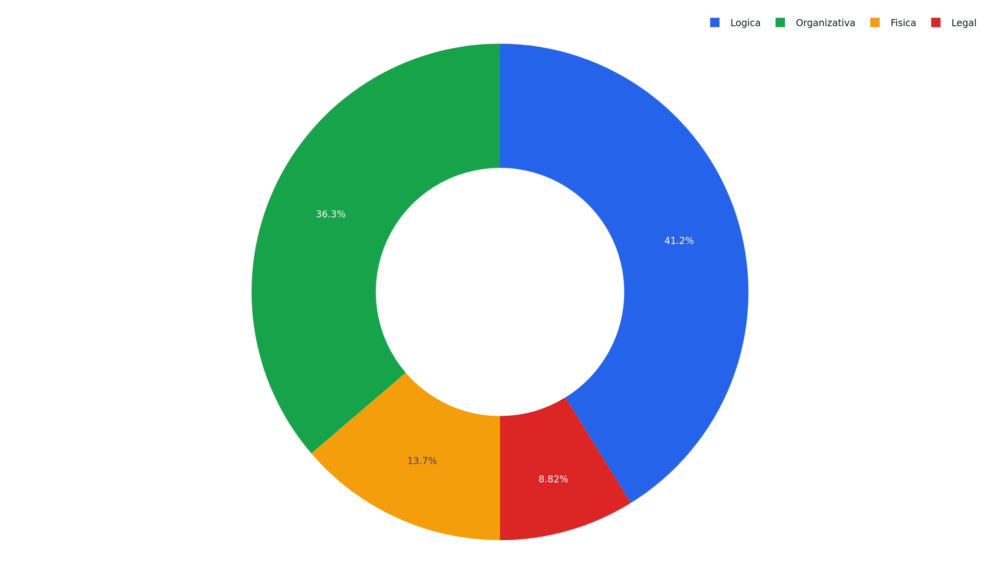

**Dónde aparece:** Tab 5 Plan, sección Tipo de proyecto.

**Para qué sirve:** Clasifica el plan por tipo de seguridad: lógica, física, organizativa o legal.

**Base teórica:** Tratamiento de riesgo: las respuestas pueden ser técnicas, organizativas, físicas o legales.

**Cómo se lee:** Cada porción muestra cobertura de controles por tipo de proyecto.

**Qué dicen los datos de TecnoHogar:** El tipo de proyecto con mayor cobertura de controles es Logica, con 42 vínculos a controles.

**Cómo explicarlo en la defensa:** Usarlo para mostrar que el plan no es solo tecnología.

**Pregunta probable:** ¿Por qué mezclar proyectos técnicos y organizativos?

**Respuesta sugerida:** Porque ISO 27002 cubre gobierno, personas, físico y tecnología; el tratamiento debe acompañar esa mezcla.

## Plan por capítulo

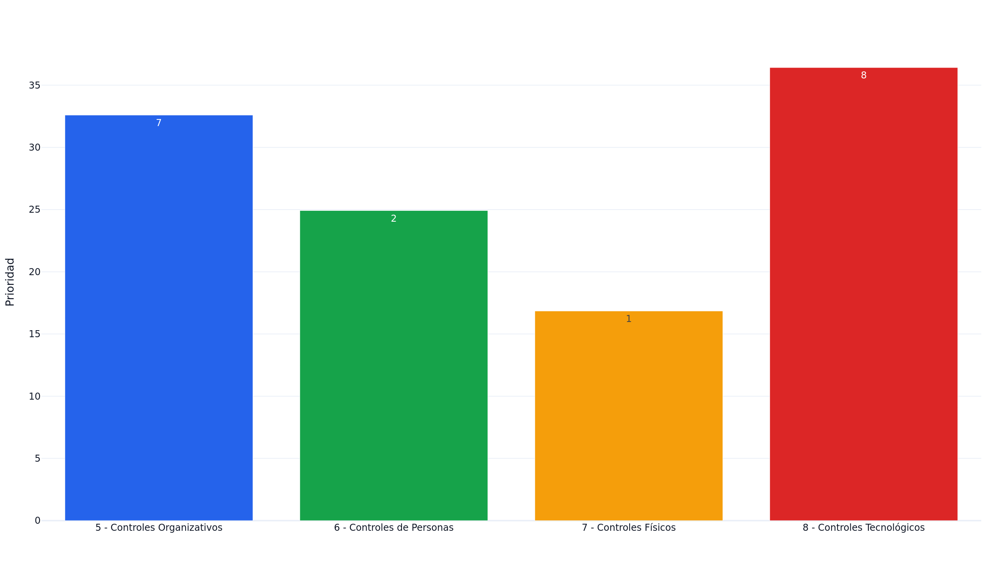

**Dónde aparece:** Tab 5 Plan, sección Plan por capítulo.

**Para qué sirve:** Relaciona prioridades del plan con capítulos ISO.

**Base teórica:** Trazabilidad de tratamiento: cada iniciativa debe cubrir controles concretos.

**Cómo se lee:** Las barras muestran prioridad por capítulo y las etiquetas cantidad de proyectos.

**Qué dicen los datos de TecnoHogar:** El capítulo con mayor prioridad de intervención es 8 - Controles Tecnológicos, con 8 proyectos vinculados.

**Cómo explicarlo en la defensa:** Mostrar que el plan cubre los capítulos donde aparecen brechas relevantes.

**Pregunta probable:** ¿Un proyecto puede cubrir más de un capítulo?

**Respuesta sugerida:** Sí. Por eso la trazabilidad control-proyecto es más importante que contar proyectos aislados.

## Plan por capacidad operacional

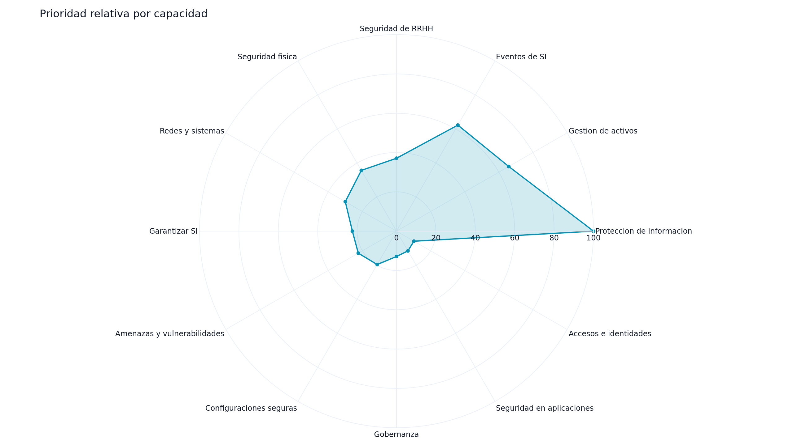

**Dónde aparece:** Tab 5 Plan, sección Plan por capacidad operacional.

**Para qué sirve:** Muestra qué capacidades reciben más prioridad relativa en el plan.

**Base teórica:** Alineación entre diagnóstico y tratamiento: las debilidades deben aparecer en el plan.

**Cómo se lee:** Cada eje indica prioridad relativa por capacidad.

**Qué dicen los datos de TecnoHogar:** La capacidad con mayor prioridad relativa del plan es Proteccion de informacion, asociada a 7 proyectos.

**Cómo explicarlo en la defensa:** Usarlo para defender que el plan responde a capacidades débiles, no a ocurrencias sueltas.

**Pregunta probable:** ¿Qué pasa si una capacidad débil no recibe máxima prioridad?

**Respuesta sugerida:** Puede pasar si el esfuerzo, dependencias o cobertura de controles cambian la secuencia recomendada.

## Roadmap de esfuerzo

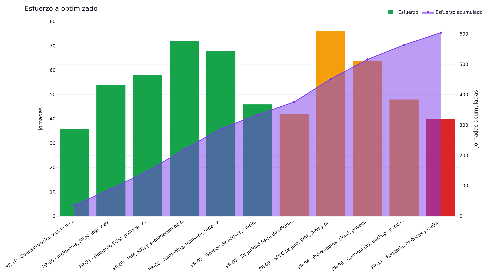

**Dónde aparece:** Tab 5 Plan, sección Roadmap de esfuerzo.

**Para qué sirve:** Ordena iniciativas y muestra esfuerzo individual y acumulado.

**Base teórica:** Gestión de ejecución: convierte el diagnóstico en una cartera implementable.

**Cómo se lee:** Las barras son jornadas por proyecto y la línea/área acumula esfuerzo.

**Qué dicen los datos de TecnoHogar:** El roadmap acumula 604 jornadas y comienza por PR-10 - Concientizacion y ciclo de vida RRHH.

**Cómo explicarlo en la defensa:** Usarlo para explicar costo de implementación y orden sugerido.

**Pregunta probable:** ¿Las jornadas son exactas?

**Respuesta sugerida:** No son presupuesto cerrado; son estimación para priorizar y comparar esfuerzo relativo.

## Matriz impacto / esfuerzo

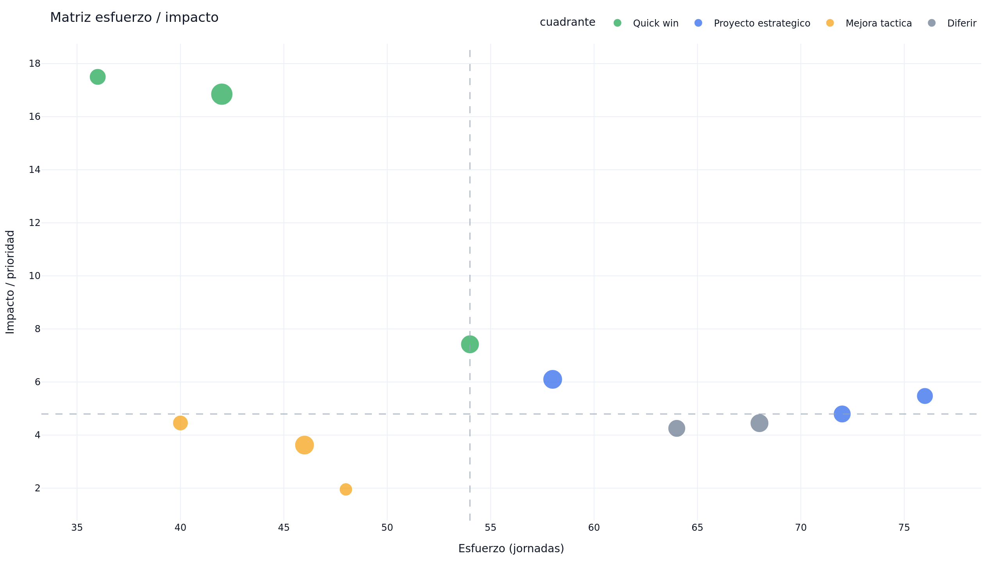

**Dónde aparece:** Tab 5 Plan, sección Quick wins.

**Para qué sirve:** Distingue quick wins, proyectos estratégicos, mejoras tácticas y acciones a diferir.

**Base teórica:** Matriz impacto/esfuerzo: técnica de priorización para tratamiento de riesgos.

**Cómo se lee:** Eje X es esfuerzo, eje Y prioridad; el cuadrante alto impacto/bajo esfuerzo son quick wins.

**Qué dicen los datos de TecnoHogar:** Hay 3 quick wins. El primero es PR-10 - Concientizacion y ciclo de vida RRHH por su combinación de impacto y esfuerzo relativo.

**Cómo explicarlo en la defensa:** Remarcar que quick win no significa superficial: significa buen retorno inicial.

**Pregunta probable:** ¿Por qué PR-10 aparece como quick win?

**Respuesta sugerida:** Porque combina prioridad alta con esfuerzo relativo menor frente a otros proyectos de la cartera.

## Esfuerzo por proyecto

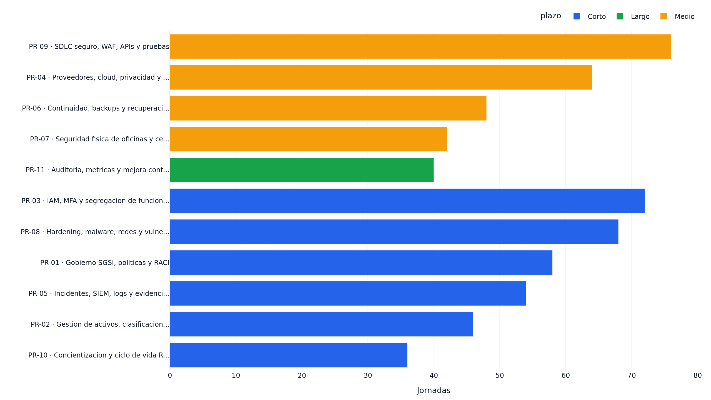

**Dónde aparece:** Tab 5 Plan, sección Esfuerzo por proyecto.

**Para qué sirve:** Compara la carga estimada de las iniciativas.

**Base teórica:** Gestión de recursos: priorizar requiere entender impacto y costo.

**Cómo se lee:** Las barras horizontales muestran jornadas estimadas; el color marca plazo.

**Qué dicen los datos de TecnoHogar:** El proyecto de mayor esfuerzo es PR-09 - SDLC seguro, WAF, APIs y pruebas con 76 jornadas.

**Cómo explicarlo en la defensa:** Usarlo para explicar por qué algunas iniciativas quedan para medio o largo plazo.

**Pregunta probable:** ¿Un proyecto grande puede ser quick win?

**Respuesta sugerida:** Normalmente no; si el esfuerzo es alto, aunque tenga impacto, se trata como estratégico.

## Sankey de trazabilidad

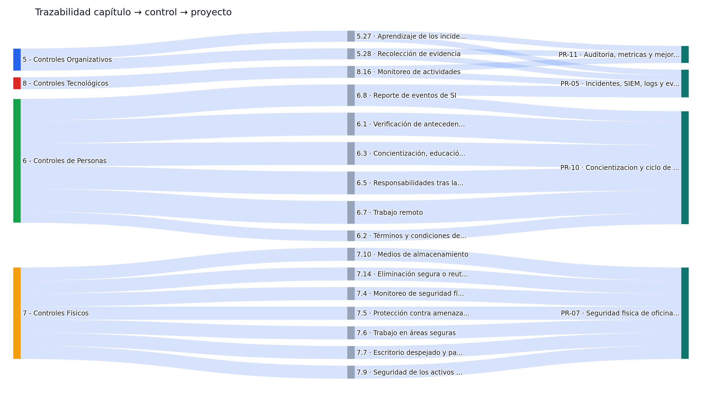

**Dónde aparece:** Tab 6 Trazabilidad, sección Cadena de decisión.

**Para qué sirve:** Muestra cómo capítulos ISO se conectan con controles y proyectos.

**Base teórica:** Trazabilidad control -> evidencia -> brecha -> proyecto: sostiene la defensa técnica del tablero.

**Cómo se lee:** Los flujos van de capítulo a control y de control a proyecto; el grosor representa peso de brecha.

**Qué dicen los datos de TecnoHogar:** La trazabilidad conecta 93 controles con 11 proyectos mediante 102 vínculos control-proyecto.

**Cómo explicarlo en la defensa:** Usarlo al final para demostrar que cada decisión del plan es explicable y auditable.

**Pregunta probable:** ¿Qué aporta frente a una tabla?

**Respuesta sugerida:** Permite ver visualmente qué controles alimentan cada proyecto y evita que el plan parezca arbitrario.
